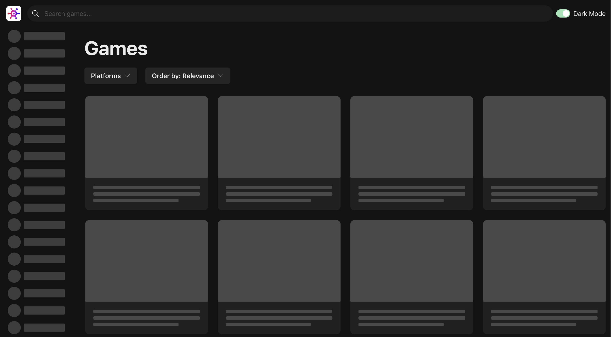
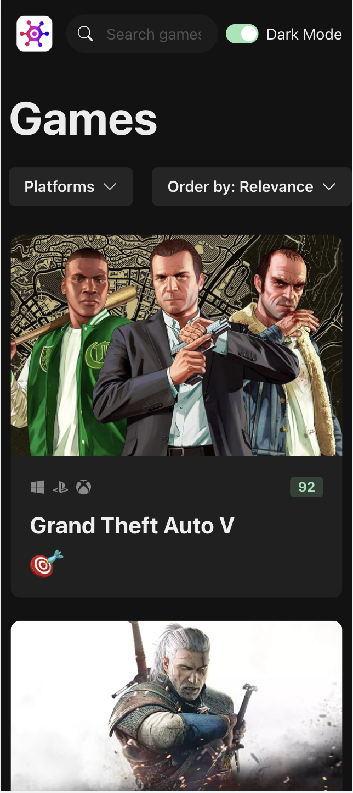

# Game Hub Discovery Web Application

Welcome to the Game Hub Discovery web application! This application leverages the RAWG API to provide a platform for discovering and exploring video games. Whether you're a gamer looking for new titles or a developer interested in using this API, this documentation will guide you through the setup and usage.






## Table of Contents
- [Getting Started](#getting-started)
  - [Prerequisites](#prerequisites)
  - [Installation](#installation)
  - [Configuration](#configuration)
- [Usage](#usage)
  - [Endpoints](#endpoints)
- [Contributing](#contributing)
- [License](#license)

## Getting Started

### DEMO [Game-Hub](https://game-hub-demo.vercel.app/).

### Prerequisites

Before you begin, ensure you have met the following requirements:
- [Node.js](https://nodejs.org/) installed on your machine.
- An API key from [RAWG API](https://api.rawg.io/docs/), which is required for accessing their data.

### Installation

1. Clone this repository to your local machine:

```bash
git clone https://github.com/shakhbozbekusmonov/game-hub.git
```

2. Navigate to the project directory:

```bash
cd game-hub
```

3. Install the project dependencies:

```bash
npm install
```

### Configuration

Create a `.env` file in the root directory of your project to store your RAWG API key:

```env
VITE_REACT_APP_API_KEY=your_api_key_here
VITE_REACT_APP_API_PATH=your_api_path_here
```

## Usage

### Endpoints

The application provides the following endpoints:

- `/games`: Retrieve a list of games.
- `/games/:id`: Get details about a specific game.
- `/search/:query`: Search for games based on a query.
- `/genres`: Retrive a list of genres.

For detailed information on how to use these endpoints, refer to the [RAWG API documentation](https://api.rawg.io/docs/).

## Contributing

We welcome contributions from the community. If you'd like to contribute to this project, please follow these steps:

1. Fork the repository.
2. Create a new branch for your feature or bug fix.
3. Make your changes and commit them.
4. Push your changes to your fork.
5. Create a pull request to the main repository.

## License

This project is licensed under the [MIT License](LICENSE).
```
